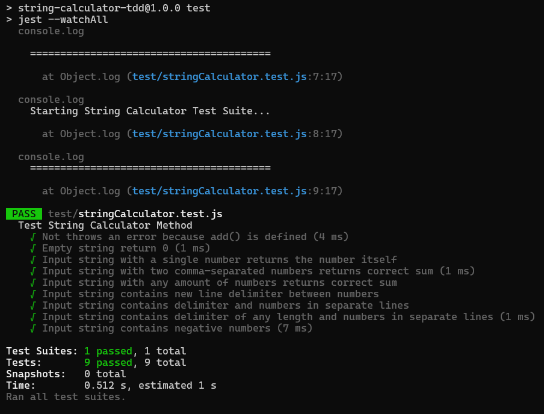

# String Calculator – TDD with Jest

This project implements a **String Calculator** using **Test-Driven Development (TDD)** in **JavaScript**, tested with **Jest**.

---

## 🧠 What is TDD?

**Test-Driven Development (TDD)** is a practice where we:

1. Describe the real-world problem clearly.
2. Start by writing the **smallest possible failing test** to express the behavior.
3. Write just enough code to make the test pass.
4. **Refactor the code** while keeping all tests green.
5. Repeat this cycle, solve the problem in an incremental approach.

This leads to **clean, modular, and well-tested code**.

---

## 🔧 Language & Testing Framework

- **Language**: JavaScript (Node.js)
- **Testing Framework**: [Jest](https://jestjs.io/)

---

## ✅ Test Results



---

## 📋 Test Cases

|                                                     |                        |                                         |          |
|-----------------------------------------------------|------------------------|-----------------------------------------|----------|
| **Test Case Description**                           | **Input Example**      | **Expected Behavior**                   | **Status**|
|                                                     |                        |                                         |          |
| **Empty string handling**                           | `""`                   | Returns `0`                             |    ✅    |
|                                                     |                        |                                         |          |
| **Single number input**                             | `"1"`                  | Returns the number itself (`1`)         |    ✅    |
|                                                     |                        |                                         |          |
| **Two comma-separated numbers**                    | `"1,5"`                | Returns sum (`6`)                       |    ✅    |
|                                                     |                        |                                         |          |
| **Multiple numbers input**                         | `"2,1,4,7,3"`          | Returns sum (`17`)                      |    ✅    |
|                                                     |                        |                                         |          |
| **Newline as delimiter**                           | `"1\n2,3"`             | Handles newlines and commas (`6`)       |    ✅    |
|                                                     |                        |                                         |          |
| **Custom single-character delimiter**              | `"//;\n1;2"`           | Uses custom delimiter (`3`)             |    ✅    |
|                                                     |                        |                                         |          |
| **Custom multi-character delimiter**              | `"//[:)]\n1:)2:)3"`    | Handles delimiters of any length (`6`)  |    ✅    |
|                                                     |                        |                                         |          |
| **Negative numbers validation**                   | `"//;\n-1;-2"`         | Throws error with negative numbers list |    ✅    |

---

## 🚀 How to Run

```bash
# Install dependencies
npm install

# Run tests
npm test
```

---

## References

- [https://youtu.be/qkblc5WRn-U](https://youtu.be/qkblc5WRn-U)
- [https://www.freecodecamp.org/news/an-introduction-to-test-driven-development-c4de6dce5c/](https://www.freecodecamp.org/news/an-introduction-to-test-driven-development-c4de6dce5c/)